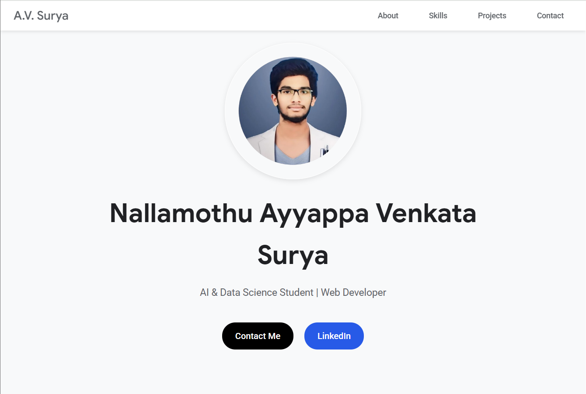

# Ayyappa Venkata Surya - Portfolio

Welcome to the personal portfolio of **Nallamothu Ayyappa Venkata Surya**, an AI & Data Science student and web developer. This project showcases my background, technical skills, notable projects, and contact information in a visually appealing, Google-inspired design.

---

## 🚀 Live Demo

View the portfolio live at: [https://surya-nallamothu.netlify.app/](https://surya-nallamothu.netlify.app/)

---

## 📸 Screenshot



---

## 📄 Table of Contents

- [About](https://github.com/nallamothusurya)
- [Features](https://github.com/nallamothusurya)
- [Skills](https://github.com/nallamothusurya)
- [Projects](https://github.com/nallamothusurya)
- [Contact](https://github.com/nallamothusurya)
- [Usage](https://github.com/nallamothusurya)
- [Technologies Used](https://github.com/nallamothusurya)
- [Contributing](https://github.com/nallamothusurya)
- [License](https://github.com/nallamothusurya)

---

## 🧑‍💼 About

I am a driven and enthusiastic individual pursuing B.Tech in Artificial Intelligence & Data Science at Seshadri Rao Gudlavalleru Engineering College. With a CGPA of **9.07/10**, my interests lie in designing scalable web applications and leveraging AI to solve real-world problems.

- **Education:**
  - B.Tech in AI & Data Science, Seshadri Rao Gudlavalleru Engineering College (2022 - 2025) — CGPA: **9.07/10**
  - Intermediate, MPC, Sri Chaitanya Junior College (2020 - 2022)

- **Languages:**  
  - English (Fluent)  
  - Telugu (Native)

---

## ✨ Features

- **Responsive Design:** Adapts to desktop and mobile screens.
- **Google-Inspired UI:** Clean, modern interface with Google Sans and Roboto fonts.
- **Projects Showcase:** Highlights personal projects with links.
- **Skills Grid:** Organized display of technical skills.
- **Contact Form:** Users can send messages directly.
- **Social Links:** Quick access to LinkedIn, GitHub, Email.

---

## 🛠️ Skills

**Programming Languages:** Python, C  
**Web Technologies:** HTML, CSS, JavaScript, NodeJS, ReactJS  
**Databases:** MongoDB, MySQL, Oracle

---

## 📚 Projects

- [**Medical AI Chatbot**](https://scrap2predict.vercel.app/):  
  A web-based AI chatbot that assists in diagnosing medical conditions and providing preliminary guidance.

- [**Notebook Web Application**](https://www.camelpad.me/):  
  A cloud-based, secure note-taking app focused on privacy and data security.

---

## 📬 Contact

- **Email:** ayyappanallamothu4@gmail.com
- **Phone:** +91 9392567247
- **LinkedIn:** [ayyappa-venkata-surya-nallamothu](https://linkedin.com/in/ayyappa-venkata-surya-nallamothu)
- **GitHub:** [nallamothusurya](https://github.com/nallamothusurya)

---

## 📦 Usage

1. **Clone the repository:**
    ```bash
    git clone https://github.com/nallamothusurya/portfolio.git
    cd portfolio
    ```

2. **Open `index.html` in your browser.**

3. To customize:
    - Update project links, contact details, and personal information in the HTML file.
    - Replace the profile picture URL as needed.
    - For deployment, host on platforms like Netlify, Vercel, or GitHub Pages.

---

## 🧰 Technologies Used

- HTML5, CSS3 (Google-inspired UI)
- JavaScript (Vanilla)
- [Font Awesome](https://fontawesome.com/) (icons)
- [Google Fonts](https://fonts.google.com/) (Google Sans, Roboto)

---

## 🤝 Contributing

Feel free to fork this project and create pull requests to suggest improvements or add features!

---

## 📄 License

This project is open source and available under the [MIT License](LICENSE).

---

**Made with ❤️ by [Ayyappa Venkata Surya](https://linkedin.com/in/ayyappa-venkata-surya-nallamothu)**
